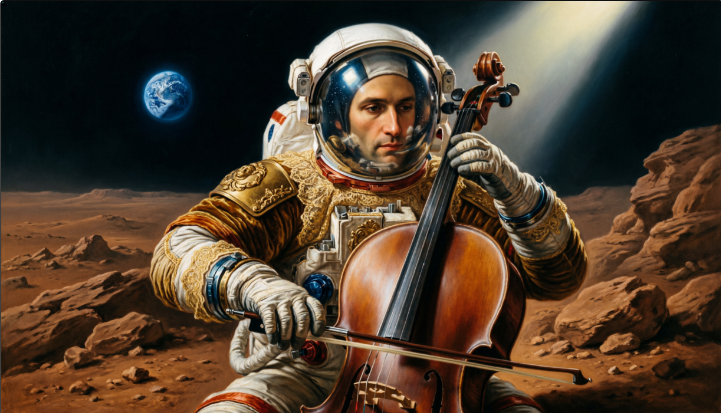

# 🎯 SM1 - A Corrida do Prompt

##  Descrição
Investigação de estratégias de prompting para melhorar a comunicação com modelos de linguagem.

##  Objetivo
Testar diferentes abordagens de prompts para um mesmo objetivo, analisando como pequenas mudanças na instrução impactam o resultado gerado pela IA.

---

## ✉️ Desafio 1 — E-mail Formal de Desculpas de um Pirata

### Prompt 1
Write a formal apology email from a pirate to a king.

### Prompt 2
Escreva um e-mail formal de desculpas de um pirata do século 18 para um rei europeu.
O pirata atacou um navio real por engano. Use linguagem respeitosa e evite gírias modernas.
O tom deve ser de arrependimento sincero.

### 📧 Resultado — E-mail Gerado

**Assunto:** Petição de Clemência e Restituição – Capitão Joaquim Correia

**Para:** Sua Majestade Real, o Rei Dom Fernando IV
**De:** Capitão Joaquim Correia, Navegação das Índias
**Data:** 14 de Novembro de 1724

Vossa Majestade,

Venho por meio desta correspondência, com a cabeça baixa e o coração pesado, dirigir-me à Vossa Real Pessoa para expressar meu mais profundo arrependimento. Sou o Capitão Joaquim Correia, e escrevo não para justificar meus atos, mas para confessá-los diante da vossa justiça.

No dia dez deste mês, nas águas ao largo do Cabo da Roca, minha embarcação encontrou-se com o navio São Vicente, sob a vossa bandeira real. Devido a uma densa bruma matinal e uma falha grave na identificação das insígnias, cometi o erro imperdoável de ordenar o abordagem, crendo tratar-se de um mercante inimigo. Somente após o ato consumado tomei conhecimento da verdadeira natureza da vossa propriedade.

Que fique claro: jamais houve intenção de desafiar a vossa Coroa ou a soberania deste Reino. O erro foi de navegação e julgamento, não de lealdade. Reconheço que a honra de um capitão reside em assumir suas falhas, e por isso, coloco-me à vossa disposição.

Todo o saque tomado — incluindo tecidos, especiarias e moedas cunhadas — foi preservado intacto e encontra-se pronto para devolução imediata no porto de Lisboa, acrescido de uma compensação em ouro pelo transtorno causado à vossa tripulação.

Peço humildemente a vossa clemência. Não busco riquezas, nem privilégios, apenas a oportunidade de limpar meu nome e provar que posso servir aos mares sem ser uma ameaça à vossa paz.

*Com a mais profunda humildade e respeito,*
**Capitão Joaquim Correia**
Comandante da Fragata Liberdade.

---

## 🎨 Desafio 2 — Pintura a Óleo: Astronauta em Marte

### Prompt 1
Pintura a óleo hiper-realista, estilo barroco. Um astronauta solitário tocando violoncelo
de madeira nobre na superfície vermelha de Marte. Traje espacial branco com detalhes em
filigrana de ouro e tecido aveludado. Fundo com terreno rochoso e a Terra visível no céu
escuro. Iluminação focada no astronauta, sombras suaves, alta resolução, obra-prima.

### Prompt 2
Obra-prima em óleo estilo Barroco, dramaticidade máxima. Técnica de chiaroscuro intensa,
reminiscente de Caravaggio. Um astronauta iluminado por um holofote divino tocando
violoncelo em Marte. Contraste forte entre luz dourada e sombras profundas. Poeira vermelha
iluminada pela luz. Atmosfera melancólica e sagrada. A Terra brilha fracamente ao fundo.

### Prompt 3
Pintura detalhada em óleo, close-up cinematográfico. Traje espacial barroco luxuoso:
cerâmica branca, ornamentos de ouro envelhecido, juntas de veludo azul profundo. Violoncelo
de madeira envernizada com reflexos de luz. Superfície de Marte com textura de poeira e
rochas nítidas. Renderização de texturas 8k, tangível, realismo tátil.

### Prompt 4
Pintura detalhada em óleo, close-up cinematográfico. Traje espacial barroco luxuoso:
cerâmica branca, ornamentos de ouro envelhecido, juntas de veludo azul profundo. Violoncelo
de madeira envernizada com reflexos de luz. Superfície de Marte com textura de poeira e
rochas nítidas. Renderização de texturas 8k, tangível, realismo tátil.

### Prompt 5
Uma pintura a óleo hiper-realista em estilo barroco, obra-prima premiada. Astronauta
vestindo traje espacial ornamentado com filigrana dourada e texturas aveludadas, tocando
apaixonadamente um violoncelo de madeira nobre. Cenário: superfície rochosa e empoeirada
de Marte. Iluminação dramática em chiaroscuro com sombras profundas e forte holofote
lateral, reminiscente de Caravaggio. Ao fundo, visão tênue da Terra no céu escuro estrelado.
Composição cinematográfica, atmosfera emocional, detalhes intricados, resolução 8k. --ar 16:9 --v 6.0

### 🖼️ Resultado Final

---

## 🛠️ Tecnologias e Ferramentas

## 📚 Matéria
Engenharia de Prompt e Aplicações em IA

